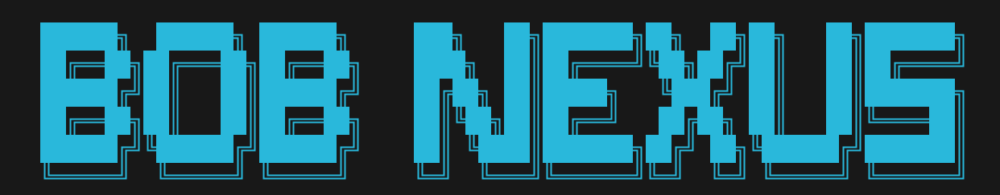

# Welcome to bob_nexus 🚀 (v0.5.0)



**The Central Nervous System and Orchestration Hub for the bob-ros2 Ecosystem.**

`bob_nexus` is the authoritative management layer for spawning, configuring, and deploying specialized AI entities. It provides a unified interface to orchestrate both LLM-based agents and standard ROS 2 nodes (visualizers, drivers, stream-engines) across Host, Docker, and Swarm environments.

---

## 🚀 Quick Start & Onboarding

### 1. Initialize the Nexus
```bash
# Automated onboarding: Clones core dependencies and builds the workspace
./onboarding.sh
```

### 2. Wake Up the Swarm
```bash
./swarm.sh up
# Spin up the management layer and core infrastructure
```

### 3. Spawn & Deploy an Entity
```bash
# cli is available in the global PATH or via master/cli.sh
cli spawn assistant alice twitch_stream
cli up alice
```

### 4. Interactive Command (`cli talk`)
```bash
# Engage with the swarm via the cyberpunk TUI Mission Control
cli talk
```

---

## 🛠️ Nexus Core Concepts

`bob_nexus` leverages **ROS 2 (Humble)** as its underlying transport mechanism, providing a decentralized and resilient backbone for all entities.

- **Self-Assembling Entities (SAE)**: Entities dynamically build their own isolated environments upon spawning.
- **Blueprint Maturity**: Configurations are resolved JIT using a recursive template engine (`${VAR:-${DEFAULT}}`).
- **Hermetic Isolation**: Secure separation of Framework (`/app`), Private Workspace (`/root`), and Secrets (`/app/master/secrets`).
- **Dynamic Skill Binding**: Shared capabilities (Skills) are symlinked/bundled to entities, enabling instant updates.
- **Observation Stack**: Integrated Grafana/Loki logging for real-time telemetry across the entire swarm.

---

## ⚙️ Operation Modes (Host vs. Swarm)

Bob Nexus supports two primary execution modes, each handling entity workspaces differently.

### 🏠 Host Mode (`mode: "host"`)
Entities run as native processes on the host system.
- **Workspace**: The folder `./entities/<category>/<name>` **IS** the actual working directory.
- **I/O**: Logs (`stdout.log`, `stderr.log`) and build artifacts are written directly to this host folder.
- **Best for**: Lightweight agents, GUI-heavy nodes, or environments where Docker isolation is unnecessary.

### 🐳 Swarm Mode (`mode: "swarm"`)
Entities run as isolated Docker containers within a managed project.
- **Registry (Host)**: `./entities/<category>/<name>` acts as the **Blueprint/Registry**. It provides the initial configuration and seeds the entity.
- **Workspace (Volume)**: The "Reality" lives in a **Named Docker Volume** (mounted at `/root`). This ensures high-performance I/O and persistence across container lifecycles.
- **Syncing**: Onboarding logic automatically synchronizes changes from the Registry to the Volume on startup.

---

## 🏗️ Architecture & CLI

### Directory Structure
```text
.
├── master/          # Core orchestration logic (Python)
├── skills/          # Reusable skill modules (memory, director, etc.)
├── templates/       # Entity blueprints and Docker Compose layers
├── entities/        # Generated entity instances (Registry)
├── requirements/    # Global and specialized dependency definitions
└── ros2_ws/         # The global ROS 2 workspace (Read-Only for assistants)
```

### The Mastermind CLI (`cli`)

| Command | Description | Example |
| :--- | :--- | :--- |
| `spawn` | Create a new entity from a template | `cli spawn assistant bob twitch_stream` |
| `up` | Start an entity (Host, Docker, or Compose) | `cli up bob` |
| `down` | Gracefully stop an entity | `cli down bob` |
| `status` | List all entities and their process/container IDs | `cli status` |
| `link` | Attach a shared skill to an entity | `cli link bob director` |
| `refresh` | Re-generate entity system prompt (Skill sync) | `cli refresh bob` |
| `refresh-skills` | Re-bundle all skills defined in manifest | `cli refresh-skills bob` |
| `talk` | Launch the interactive Mission Control TUI | `cli talk` |

---

## 🧠 System Prompts & Dynamic Skills

The Nexus manages agent personas through an externalized orchestration layer.

### 1. Externalized Prompts
We strongly recommend using `system_prompt: ./system_prompt.txt` in your `agent.yaml`. This avoids YAML formatting issues and enables clean Markdown personas.

### 2. Automated Marker Injection
The Nexus automatically advertises linked skills by looking for specialized markers in your prompt file:
```text
# --- NEXUS SKILLS PROMPT START ---
(Dynamically updated skill descriptions go here)
# --- NEXUS SKILLS PROMPT END ---
```
Use `cli refresh <name>` to forcefully re-scan linked `SKILL.md` files and update the agent's awareness.

---

## 🛡️ Quality & Integrity
Maintain system standards via the **Quality Suite**:
- `make lint`: Static analysis with **Ruff**.
- `make format`: Consistent code formatting.
- `make test`: Global integrity checks (YAML, Paths, Symlinks).
- `python3 tests/system_sanity.py`: E2E verification using a Mock LLM Backend.

---

## 🗺️ Roadmap
- **Zenoh Bridge**: Encrypted internet tunnels for cross-site swarms.
- **Stray Logic**: Integration of non-technical strategic entities (Finance, Marketing).
- **Hardened Isolation**: Per-entity system users for extreme process segregation.
- **Perception Layer**: Dedicated Vision-Language (VLM) processing nodes.

---
> *"The identity is independent of the matter. Whether process, container, or distributed across networks—the nexus remains the core."* -- Experiment 7!
